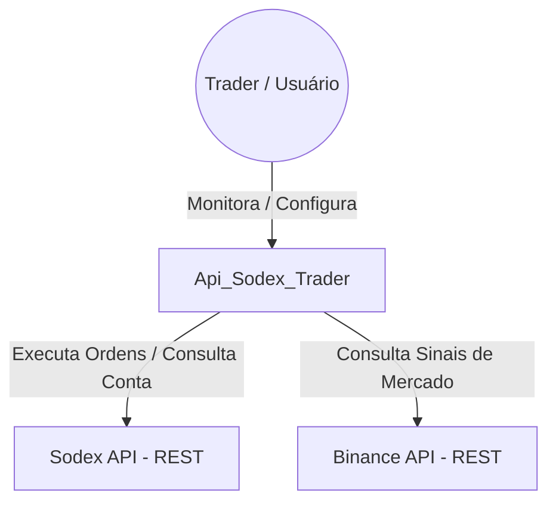
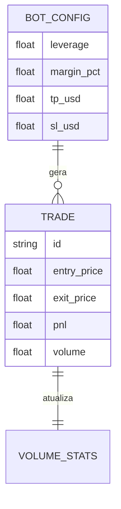

# Arquitetura do Sistema — Api_Sodex_Trader

Este documento descreve a estrutura técnica, os componentes e as integrações do projeto.

## Visão Geral

O **Api_Sodex_Trader** é um sistema de trading algorítmico de alta frequência, desenhado para rodar localmente e interagir com a exchange descentralizada/centralizada Sodex. Ele possui uma arquitetura desacoplada em três camadas: Comunicação (API Client), Lógica (Trading Bot) e Visualização (Dashboard).

## Diagrama C4 Contexto

## Componentes Principais

1.  **Core (Sodex Client)**: Camada de transporte que lida com a autenticação EIP-712 e o protocolo de comunicação com a Sodex.
2.  **Strategy (Scalping Bot)**: O orquestrador da lógica de negociação. Consome dados de mercado (Sodex e Binance) e toma decisões de entrada/saída.
3.  **Analytics (Volume Tracker)**: Módulo de persistência leve que rastreia o progresso das metas de volume e PnL.
4.  **Dashboard (FastAPI + WS)**: Servidor que expõe os dados internos do bot para uma interface web via WebSockets.

## Modelo de Dados (ERD Resumido)

Como o sistema utiliza persistência leve (JSON/Logs), o modelo de dados é simples:

## Integrações e Protocolos

- **Sodex API**: REST (HTTPS) com cabeçalhos customizados para assinatura criptográfica.
- **Binance API**: REST (HTTPS) público para dados de mercado auxiliares.
- **Dashboard Interface**: WebSocket (WS) para streaming de dados em tempo real e HTTP para endpoints de sincronização.

## Dívidas Técnicas Identificadas
- 🟡 **Persistência**: O uso de arquivos JSON e Logs como banco de dados principal limita a escalabilidade e a integridade dos dados em caso de crash.
- 🟡 **Sincronização**: A lógica de polling (REST) pode ser lenta comparada a uma integração via WebSocket nativa com a Sodex (que o cliente suporta mas o bot não utiliza totalmente para sinais).
- 🟢 **Segurança**: As chaves privadas são carregadas via `.env`, o que é aceitável para uso local, mas requer cuidado em ambientes compartilhados.
