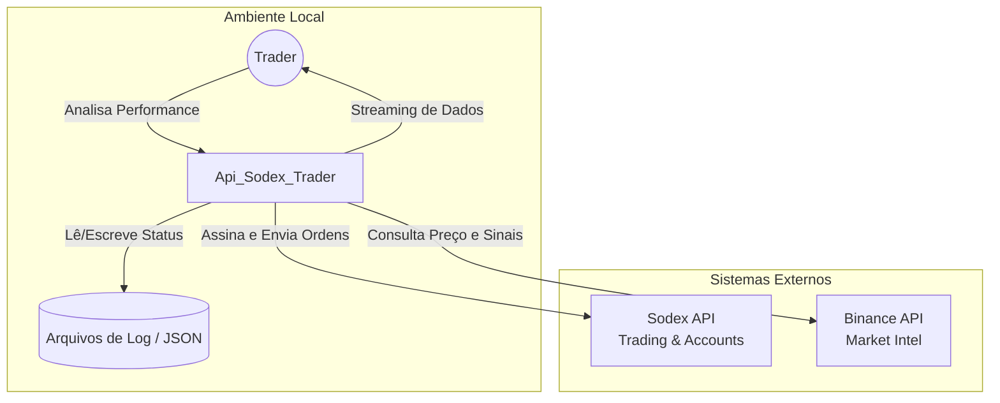

# C4 Contexto — Api_Sodex_Trader

Diagrama de contexto de nível 1 mostrando as interações externas do sistema.

## Relacionamentos

| De | Para | Protocolo | Descrição |
| :--- | :--- | :--- | :--- |
| `System` | `Sodex` | HTTPS / EIP-712 | Execução de trades e consulta de saldo |
| `System` | `Binance` | HTTPS | Coleta de CVD, Funding e EMAs de referência |
| `User` | `System` | WebSocket | Monitoramento em tempo real via Browser |
| `System` | `Logs` | File System | Persistência de histórico de trades e SOPoints |
